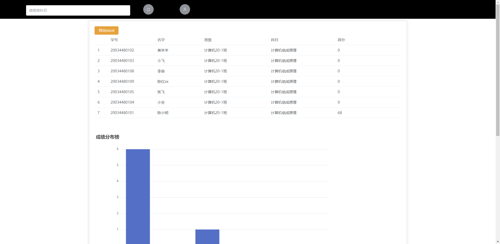

# Exam

#### 介绍
一款基于SpringBoot3和Vue3的Web在线考试平台
老师可以线上上传试卷创建考试，学生可以在线考试
使用EasyExcel支持导入和导出教职工和学生数据,方便与学校对接
学生选择题判断题通过选项上传,其他题型通过拍照上传答案,老师后台阅卷

#### 优势
随着硬盘的价格下降,相比于纸质存储更加便宜,教育局抽查更加方便,解放老师选择判断题的评分,由后台自己完成,
可以直接批改填空题等综合题的评分

#### 软件架构
SpringBoot3、MybatisPlus、Mysql、MinIO、Redis、docker      
Vue3、ElementPlus、Piana

#### 安装教程

#### 未解决问题

1.  目前只支持特定格式的Word文档试卷,
2.  作弊行为无法监测
3.  只能用邮箱代替手机验证码